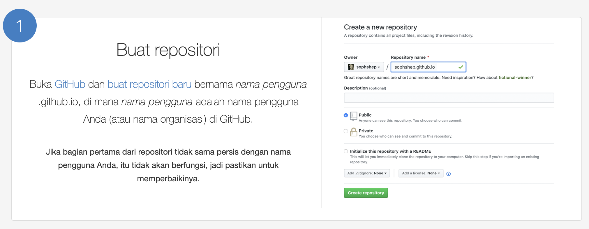
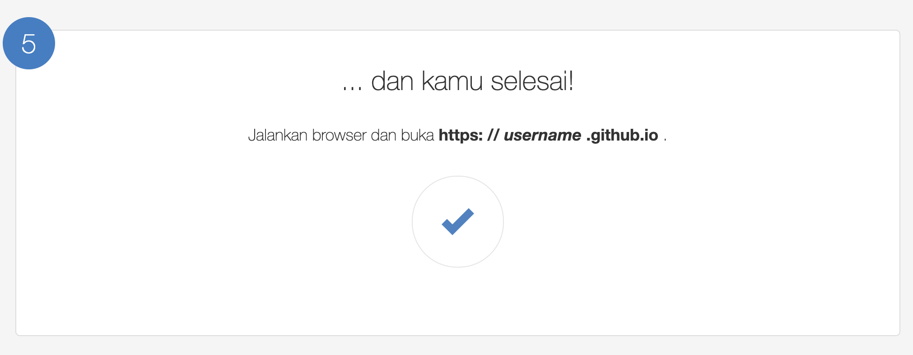

<h1 align="center">Profil Portofolio</h1>  

  

  Halaman ini merupakan profil konten portofolio saya.

  

<!-- START doctoc generated TOC please keep comment here to allow auto update -->
<!-- DON'T EDIT THIS SECTION, INSTEAD RE-RUN doctoc TO UPDATE -->
## Tabel Konten

- [Pengenalan](#pengenalan)
- [Pilih Tema](#tema)
- [Publikasi](#publikasi)

<!-- END doctoc generated TOC please keep comment here to allow auto update -->

## Pengenalan

Portofolio merupakan hal yang berpengaruh penting untuk menunjukkan/mengenalkan diri Anda kepada klien. Kode sumber ini merupakan portofolio atau Curriculum Vitae untuk mengenalkan diri Anda secara profesional.

## Tema

Anda dapat memilih tema yang sesuai dengan selera dan karakter diri Anda. Setelah selesai memilih tema yang sesuai, Anda dapat mulai mengisi profil diri Anda. Berikut merupakan beberapa [referensi tema](https://colorlib.com/wp/html5-resume-templates/) yang tersedia secara *bebas:

*Syarat dan kondisi berlaku 

  

  

## Publikasi

Portofolio/Resume Curriculum Vitae yang Anda buat dapat dipublikasikan dan diakses dengan browser secara gratis/bebas sehingga klien dapat dengan mengetahui profil profesional Anda. Anda dapat melakukan dengan cara [sebagai berikut](https://pages.github.com/):
1. Buat repositori penyimpanan kode Anda

2. Kloning dan simpan repositori anda pada lokal komputer

3. Salin hasil profil yang telah diunduh pada [Pilih Tema](#tema) kemudian edit dan isikan profil Anda 
4. Dorong/push kode portofolio Anda ke repositori penyimpanan github 

5. Buka browser dan akses alamat akun https://*akun*.github.io 

## Dukungan

Terima kasih rekan-rekan, untuk mendapatkan informasi menarik lainnya Anda dapat melihat blog dan konten saya di kanal [Medium](https://medium.com/@fdimarh), serta Anda dapat mengunduh aplikasi yang telah saya kembangkan di [Playstore saya](https://play.google.com/store/apps/developer?id=Ngecamp+Indonesia).
